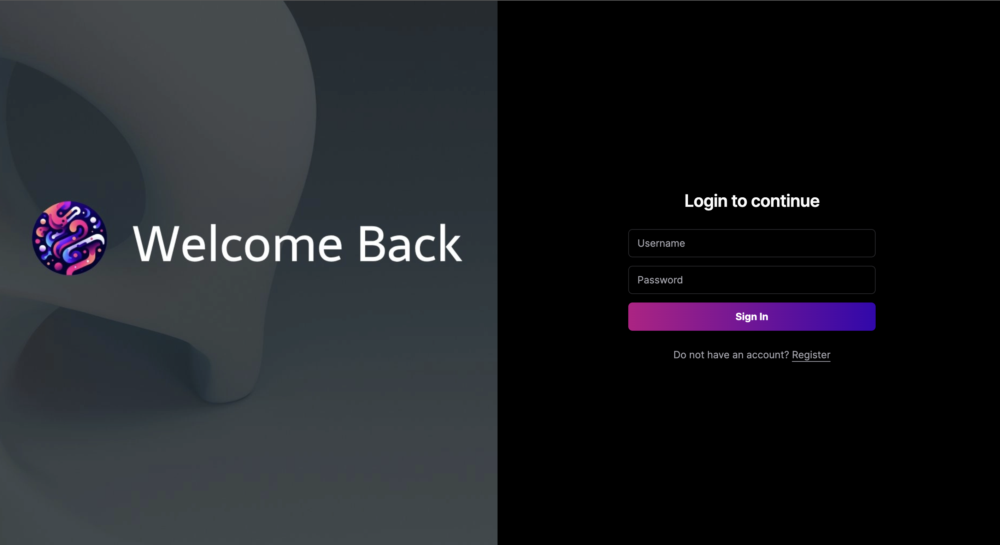

## Badges

Use it as you want

## <a href="https://github.com/oguzhan18/fastbio-backend"> Click for the Back-End project. </a>

 
## Making
- Ease of Use.
- Next
  
## Screenshots 
 

  
  
  
  
 

## For Support
For support, send an email to oguzhancart1@gmail.com or you are invited to our telegram channel https://t.me/vsform_tr  
 
## Contact Me

